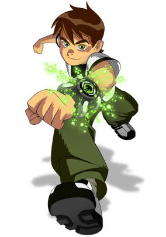

# Quiz on Ben10 & Kiteretsu with chalk

## Gameplay 🎮
There are 4 options for each question, choose the correct answer.
Choose the correct option by entering the Option no. i.e 1, 2, 3, 4

Players will have to answer correctly to get 1 point and a wrong answer will result in deducting 1 point from your total points. 
To enter Level 2, you will need to maintain a positive score.

It has Two Levels:

Level1️⃣ - Ben 10 ⌚

Level2️⃣ - Kiteretsu 🧬

## How to launch the Quiz 🚀

* Click the link given in description or [here](https://repl.it/@nisargpawade/Quiz-on-Ben10andKiteretsu-with-chalk?embed=1&output=0#index.js "Link to Quiz").
* Run the code
  * Play button on bottom left corner.

